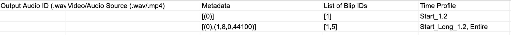
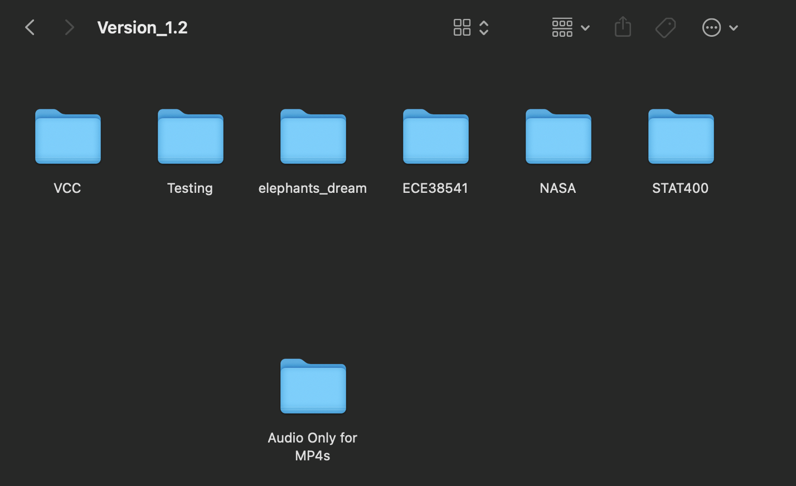
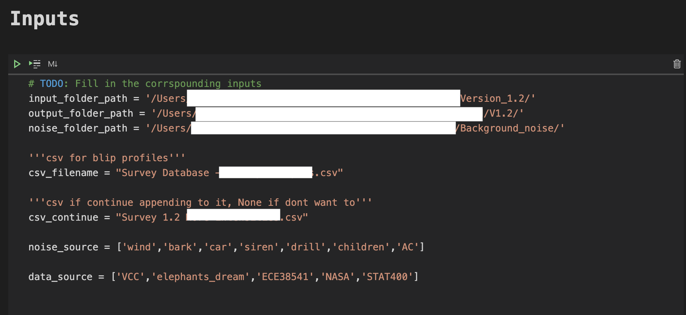

# Blip Engine
This section of the code were used to generate the data used in the survey and training data for the model. The audio data are introduced to degradations (blips). 

It supports wav for audio files and mp4 for video. 

**There are two versions of deliverables:**
1.  a jupyter notebook (Audio Blip Engine.ipynb)
2.  a command line (blip_engine.py)

**For both versions we use a .csv file to choose what blips to apply. Jupyter notebook version gives more flexibility but the exectable is easier to use**

Since we not only have to generate the blips, we also have to apply them to hundreds to thousands of audio clips to generate the dataset, we decided to use .csv files to choose different settings (Profile) for the audio files since it gives the most flexibility and scalability. Usage will be discussed below. 

---
Let first also introduce some terms fo ease of reading:
```
1. Blip
    1.1: Definition: A degradation in an audio
2. Profile
    2.1: Definition: A row in the .csv file that specifies for input x, what blip to induce, when it happens and its intensity. It is applied to ALL audios in the input folders

```

---

### Steps for generating dataset
 1. Installation
 2. Fill in a .csv file as shown below and use it to specify what blips and intensity 
 3. Generating the dataset: First put all input audios in folders (detials below). Then call the main file with the .csv file to generate the dataset. All of the profiles in the .csv file are applied for all audio files. For example if the input is only one audio file and there are 5 profiles, then the output would be 5 audio files with each of the profile applied to the input. 

 -----------------
## 1. Installation

```bash

```

## 2. Profile .csv usage

The profile .csv is used to describe for all audio samples that we want to blip (introduce degradations), what blip we want to introduce and at what intensity. We could also introduce multiple blips to a since audio. 



The image above shows an [example](https://docs.google.com/spreadsheets/d/1Ad1t-VBna2iFDnf3ZszFBV2Tl-ETaaTYMYq4KCT9quc/edit?usp=sharing) of designing a profile. Only the columns **Metadata**, **List of Blip IDs** and **Time Profile**. The profile can be designed in google sheets for example and download as .csv. 

There are different blip ids, each corrspounding to a blip. Metadata for each blip corrspound to the different intensities. Note that the **[ . ]** must be enetered in the .csv file. Also for **Metadata**, put the metadata in a list **[ . ]** with everything in a tuple. Time profile specifies when and how long each blip occurs. For blips they have to use *Entire* since it is only applicable to the whole of the audio clip. 

For metadata below, each entry will have a description:domain/example, where domain defines the range of numbers accepted or example for an example. 

**Blip Table:**
| Blip ID        | Blip           | Metadata  | Profile or Entire clip |
| ------------- |:-------------:| -----:| ---------:|
| 1      | PacketDrop | [(number of blocks of the sample size to drop in the segment: 0 to as number of samples)] |  Profiles |
| 2     |   PacketlLoss    |   [(packetloss mode: {0},percentage of packetloss: 0.0 to 1.0 , frame size of packet in time: 0.02 which is 20 ms, sampling rate: 44100 not **required**)] |  Profiles |
| 3     |  Lagging     |   [(speed of playback audio: 1.5 , sampling rate: {actual sampling rate or 0})] |  Profiles |
| 4     |   White Noise    |   [(intensity: 0 to 100 with increasing intensiy)] | Entire Clip |
| 5     |  Compression     |   [( codec: { 0 for AAC-LC , 1 for OPUS , 2 for AAC} ,bitrate: refer to FFmepg bitrates,complexity: 0 to 10 0 for else,sampling rate: 44100 not **required**)] | Entire Clip |
| 6     |   Reverberation    |  [(sampling rate: **required**,time delay,delay constant)]  | Entire Clip |
| 7     | Echo      |   [(sampling rate: not **required**, time delay: in seconds , decay constant: intensity of delayed audio example 0.9)] | Entire Clip |
| 8     | Bandwidth Limited      |   [(codec: 0 for AAC-LC and 1 for OPUS and 2 for AAC, cutoff frequency in Hz: ex. 6000 , complexity: 1 to 10 only for opus, sampling rate: not **required**)] | Entire Clip |
| 9     | Frequency Range       |   NA | Entire Clip |
| 10     | Overlapping Speech      |   NA (Refer to the other file) | Profiles |
| 11     | Speaker issues (too far/close to mic)      |   NA | Entire Clip |
| 12     | Background Noises      |   [(intensity of background noise: for example 0.5 or 1)] | Profiles |


**Profiles:**
| Profiles |
|----|
| Start_1.2: 10 percent of the audio in the begining one third of the audio has an degradation applied |
| Middle_1.2: 10 percent of the audio in the middle one third of the audio has an degradation applied |
| End_1.2: 10 percent of the audio in the end one third of the audio has an degradation applied  |
|Start_Long_1.2: 30 percent of the audio in the begining one third of the audio has an degradation applied  |
|Middle_Long_1.2: 30 percent of the audio in the middle one third of the audio has an degradation applied |
|End_Long_1.2: 30 percent of the audio in the end one third of the audio has an degradation applied |
|Start_Short_1.2: 5 percent of the audio in the begining one third of the audio has an degradation applied |
|End_Short_1.2: 5 percent of the audio in the begining one third of the audio has an degradation applied |


**Note**
1. **9. Frequency Range** and  **11. Speaker issues** were not implmented 
2. **10. Overlapping Speech** is implemented in another file due to the different number of files that needs to be used


## 3. Usage

First put all audios in master and slave folders. The master is where all the different slave folders are. 


In this example, master is *Version_1.2* and the slaves are the folders in the screenshot. 

The jupyter notebook version gives more flexibility as to which slave folder to include in the output as well as which background noise source to use.  

**Inputs**
```
1. Path to master folder *input_folder_path*
2. Path to output folder *output_folder_path*
3. Path to background noise *noise_folder_path*
4. profile csv filename  *csv_filename*
5. (jupyter version only) csv filename of an output file that tge engine can continue writing to *csv_continue* 
6. (jupyter version only) noise sources to use *noise_source*
7. (jupyter version only) data sources to use, this allows the user to choose which slave folder to use  *data_source*
```

**Outputs**
```
1. csv file with all the output audios and their corrspounding metadata and name mapping
2. blipped audio at output folder
```

## <ins>**Command Line**</ins>


```bash
python blip_engine.py  -i <input_folder_path> -n <noise_folder_path> -o <output_folder_path> -p <csv_filename>
```


## <ins>**Jupyter Notebook**</ins>

Example of inputs in the jupyter notebook



## Example 


## Contributing


